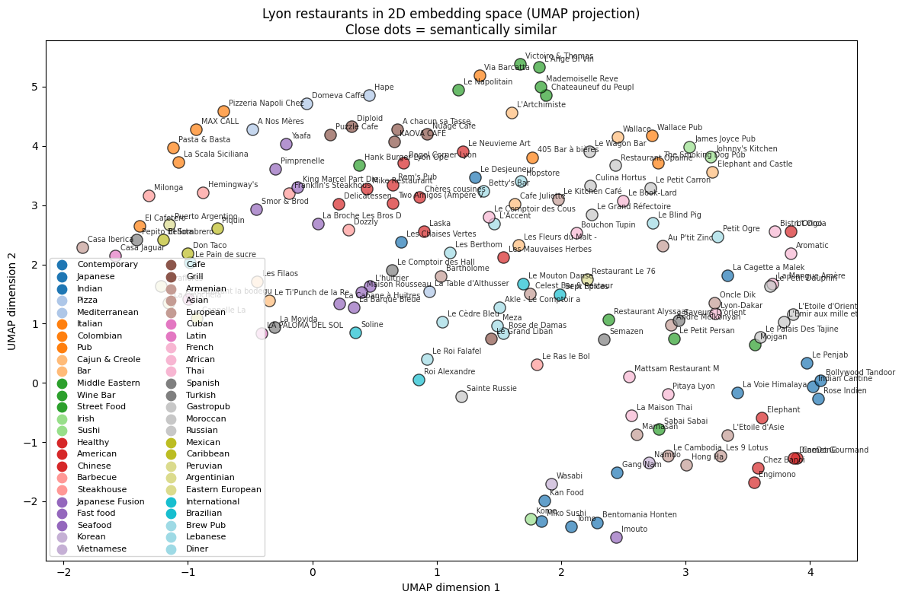

# Connoisseur Companion

> A conversational AI agent that recommends **Lyon restaurants** by name, cuisine, or vibe — powered by **Claude** and the **Model Context Protocol (MCP)**.


## What it does

Connoisseur Companion is a small AI agent that helps users discover restaurants in Lyon, France, through natural conversation. You can ask things like:

- *"Tell me about Daniel et Denise."*
- *"Find me a cozy bouchon in Vieux Lyon."*
- *"Recommande-moi un endroit pour un dîner romantique."*

The agent decides which tool to call (lookup, vibe search, or review fetcher), retrieves the data from a curated set of **~148 Lyon restaurants**, and replies in natural language.

## Architecture

The project is split into two independent processes that talk to each other through the Model Context Protocol:

```
┌──────────────┐      user message      ┌────────────────────┐
│   Gradio UI  │ ─────────────────────► │   Host (app.py)    │
│  (browser)   │ ◄─────────────────────│                    │
└──────────────┘   final answer text    │  - calls Claude    │
                                        │  - runs ReAct loop │
                                        └─────────┬──────────┘
                                                  │ MCP (stdio)
                                                  ▼
                                        ┌────────────────────┐
                                        │ MCP Server         │
                                        │ (server.py)        │
                                        │                    │
                                        │ Tools:             │
                                        │ • get_restaurant_  │
                                        │   info             │
                                        │ • recommend_by_    │
                                        │   vibe             │
                                        │ • get_review       │
                                        └─────────┬──────────┘
                                                  │
                                                  ▼
                                        ┌────────────────────┐
                                        │ Local data files   │
                                        │ (JSON + TXT)       │
                                        └────────────────────┘
```

The **MCP server** is reusable: any MCP-compatible client (this app, Claude Desktop, a custom CLI…) can plug into it without changing the server code.

## Tech Stack

- **Python 3.12**
- **Claude Haiku 4.5** via the Anthropic API (cheap, fast, and well-suited for tool use)
- **Voyage AI** (`voyage-3-lite`) — 512-dim text embeddings for semantic restaurant search
- **FastMCP** — Python framework for building MCP servers
- **MCP Python SDK** — protocol implementation
- **Gradio 5** — web chat interface
- **pandas** — data exploration and pipeline transformations
- **python-dotenv** — environment variable loader

## Data Pipeline

The dataset is built through a 5-step pipeline, fully reproducible from the Jupyter notebooks in `notebooks/`:

```
TripAdvisor European    Filter Lyon       Extract vibes       Generate reviews     Vector embeddings
restaurants dataset  →  + quality      →  with Claude     →  with Claude       →  with Voyage-3-lite
(1M+ restaurants)       (~148 selected)   (vibes,             (2 per restaurant,    (512-dim vectors)
                                          signatures,         one positive,
                                          descriptions)       one critical)
```

**Source**: [TripAdvisor European Restaurants on Kaggle](https://www.kaggle.com/datasets/stefanoleone992/tripadvisor-european-restaurants) (~1M restaurants).

**Filtering** (notebooks `02` and `03`): we filter for restaurants in Lyon, France with a rating ≥ 4.0 and ≥ 50 reviews, then use stratified sampling across primary cuisine types to preserve diversity (so the agent doesn't only recommend bouchons).

**Enrichment** (notebook `04`): the TripAdvisor data lacks the kind of descriptive content needed for a conversational agent (atmosphere tags, signature dishes, honest shortcomings). For each restaurant, we prompt Claude Haiku to generate this enriched profile, grounded in the factual metadata (cuisine, price, rating). Results are saved incrementally to survive crashes.

**Synthetic reviews** (notebook `05`): TripAdvisor's Kaggle export does not include review text, only aggregate statistics. We generate **two synthetic reviews per restaurant** with Claude (one positive-leaning, one critical-leaning) to provide variety. **These reviews are transparently synthetic** — they're labeled and don't claim to be from real users. The agent uses them via the `get_review` tool.

**Vector embeddings** (notebooks `07` and `08`): each restaurant is converted to a 512-dimensional vector using Voyage AI's `voyage-3-lite` model. The embedding text combines name, cuisine, atmosphere tags, signature dishes, and shortcomings. These vectors will power semantic search in Phase 3 — a user asking for a "romantic candlelit dinner" will match restaurants tagged "intimate" or "cozy" even without word overlap. A UMAP projection in 2D confirms the embeddings cluster meaningfully by cuisine and atmosphere.

**Total cost**: ~2 USD for the full pipeline. Embedding generation is essentially free (well under Voyage's 200M tokens free tier).

## Semantic embeddings visualization

Each restaurant in the catalogue is represented as a 512-dimensional vector. To verify these embeddings capture meaningful information, we project them to 2D using UMAP:



Restaurants with similar atmospheres and cuisines cluster together, confirming that the embeddings will support semantic queries effectively in Phase 3.

## Quick Start

### 1. Clone the repo

```bash
git clone https://github.com/Arrsaid/connoisseur-companion.git
cd connoisseur-companion
```

### 2. Create and activate a virtual environment

```bash
python -m venv .venv
# Windows
.\.venv\Scripts\Activate.ps1
# macOS / Linux
source .venv/bin/activate
```

### 3. Install dependencies

```bash
pip install -r requirements.txt
```

### 4. Add your API keys

Create a `.env` file at the project root:

```
ANTHROPIC_API_KEY=sk-ant-api03-your-key-here
VOYAGE_API_KEY=pa-your-key-here
```

You can get an Anthropic key at [console.anthropic.com](https://console.anthropic.com/) and a Voyage AI key at [dashboard.voyageai.com](https://dashboard.voyageai.com/). The Lyon restaurant data is committed to the repo in `data/`, so you can run the app immediately without re-running the data pipeline. To rebuild the dataset from scratch, see the notebooks in `notebooks/`.

### 5. Run the app

```bash
python -m connoisseur.app
```

Then open the local URL printed in the terminal (usually `http://127.0.0.1:7860`).

## How it works

The host application (`app.py`) runs a simple **ReAct loop**:

1. The user sends a message.
2. Claude receives the message along with the list of MCP tools.
3. Claude either replies directly, or asks to call a tool.
4. If a tool is called, the host forwards the call to the MCP server, gets the result, and feeds it back to Claude.
5. The loop continues until Claude produces a final text answer.

The MCP server (`server.py`) exposes three tools:

| Tool | Purpose |
|---|---|
| `get_restaurant_info` | Look up a restaurant by name |
| `recommend_by_vibe` | Find restaurants matching a mood (e.g. *cozy*, *romantic*) |
| `get_review` | Fetch a detailed review for a restaurant |

## Tests

The MCP server is covered by an integration test suite using pytest and pytest-asyncio.

To run the tests:

```bash
pip install -r requirements-dev.txt
pytest
```

The suite spins up a fresh MCP server for each test, calls the tools through stdio, and asserts on the parsed JSON responses.

## Roadmap

The project is built in phases:

- [x] **Phase 1** — Clean baseline with mock data, MCP server, Gradio host, pytest suite
- [x] **Phase 2** — Real Lyon restaurant data via TripAdvisor + Claude-augmented enrichment pipeline
- [ ] **Phase 3** — Semantic search with embeddings and a vector database (Chroma)
  - [x] Voyage-3-lite embeddings for all restaurants
  - [x] UMAP visualization confirming semantic clustering
  - [ ] Chroma vector database integration
  - [ ] New `recommend_by_vibe_v2` tool with hybrid search
  - [ ] New `summarize_reviews` tool (RAG pattern)
- [ ] **Phase 4** — Deployment to Hugging Face Spaces and Claude Desktop integration
- [ ] **Phase 5** — Evaluation metrics, observability, and multilingual support

## Project structure

```
connoisseur-companion/
├── connoisseur/                    # Application code (package)
│   ├── __init__.py
│   ├── app.py                      # Gradio host + ReAct loop
│   └── server.py                   # MCP server with 3 tools
│
├── notebooks/                      # Reproducible data pipeline
│   ├── 01_explore_dataset.ipynb
│   ├── 02_filter_and_select.ipynb
│   ├── 03_extract_vibes_with_claude.ipynb
│   ├── 04_generate_reviews_with_claude.ipynb
│   ├── 05_export_to_server_format.ipynb
│   ├── 06_explore_voyage_embeddings.ipynb
│   └── 07_generate_embeddings.ipynb
│
├── data/                           # Production data served by the agent
│   ├── lyon-restaurants.json       # ~148 enriched Lyon restaurants
│   ├── lyon-reviews.json           # ~296 synthetic reviews
│   ├── lyon-culinary-map.txt       # Free-text culinary guide
│   ├── lyon-embeddings.json        # 512-dim Voyage embeddings
│   ├── raw/                        # (gitignored) TripAdvisor source data
│   └── processed/                  # (gitignored) intermediate pipeline outputs
│
├── tests/                          # pytest test suite
│   ├── __init__.py
│   └── test_server.py
│
├── docs/                           # Visual documentation
│   ├── demo.png
│   └── embeddings_umap.png         # 2D UMAP projection of all restaurants
│
├── .env                            # API keys (not committed)
├── .gitignore
├── LICENSE
├── pytest.ini
├── README.md
└── requirements.txt            # Dependencies (pytest, jupyter, pandas, ...)
```

## Author

**Said Arrazouaki**
GitHub: [@Arrsaid](https://github.com/Arrsaid)

## License

MIT — see [`LICENSE`](LICENSE) for details.
