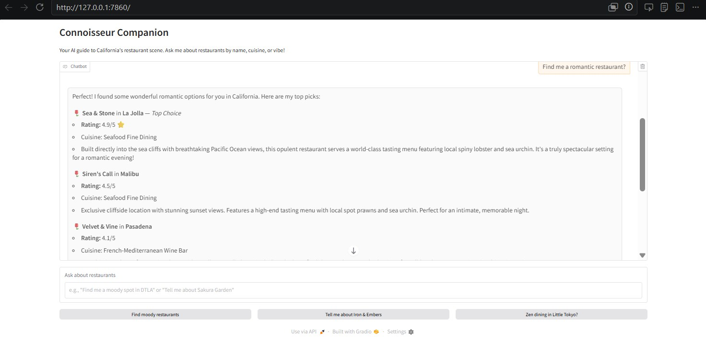

# Connoisseur Companion

> A conversational AI agent that recommends California restaurants by name, cuisine, or vibe — powered by **Claude** and the **Model Context Protocol (MCP)**.



## What it does

Connoisseur Companion is a small AI agent that helps users discover restaurants through natural conversation. You can ask things like:

- *"Tell me about Iron & Embers."*
- *"Find me a moody spot in DTLA."*
- *"What's a zen dining experience in Little Tokyo?"*

The agent decides on its own which tool to call (lookup, vibe search, or review fetcher), gets the data, and replies in plain language.

## Architecture

The project is split into two independent processes that talk to each other through the Model Context Protocol:

```
┌──────────────┐      user message      ┌────────────────────┐
│   Gradio UI  │ ─────────────────────► │   Host (app.py)    │
│  (browser)   │ ◄─────────────────────│                    │
└──────────────┘   final answer text    │  - calls Claude    │
                                        │  - runs ReAct loop │
                                        └─────────┬──────────┘
                                                  │ MCP (stdio)
                                                  ▼
                                        ┌────────────────────┐
                                        │ MCP Server         │
                                        │ (server.py)        │
                                        │                    │
                                        │ Tools:             │
                                        │ • get_restaurant_  │
                                        │   info             │
                                        │ • recommend_by_    │
                                        │   vibe             │
                                        │ • get_review       │
                                        └─────────┬──────────┘
                                                  │
                                                  ▼
                                        ┌────────────────────┐
                                        │ Local data files   │
                                        │ (JSON + TXT)       │
                                        └────────────────────┘
```

The **MCP server** is reusable: any MCP-compatible client (this app, Claude Desktop, a custom CLI…) can plug into it without changing the server code.

## Tech Stack

- **Python 3.12**
- **Claude Haiku 4.5** via the Anthropic API (cheap, fast, and well-suited for tool use)
- **FastMCP** — Python framework for building MCP servers
- **MCP Python SDK** — protocol implementation
- **Gradio 5** — web chat interface
- **python-dotenv** — environment variable loader

## Quick Start

### 1. Clone the repo

```bash
git clone https://github.com/Arrsaid/connoisseur-companion.git
cd connoisseur-companion
```

### 2. Create and activate a virtual environment

```bash
python -m venv .venv
# Windows
.\.venv\Scripts\Activate.ps1
# macOS / Linux
source .venv/bin/activate
```

### 3. Install dependencies

```bash
pip install -r requirements.txt
```

### 4. Add your Anthropic API key

Create a `.env` file at the project root:

```
ANTHROPIC_API_KEY=sk-ant-api03-your-key-here
```

You can get a key at [console.anthropic.com](https://console.anthropic.com/).

### 5. Run the app

```bash
python app.py
```

Then open the local URL printed in the terminal (usually `http://127.0.0.1:7860`).

## How it works

The host application (`app.py`) runs a simple **ReAct loop**:

1. The user sends a message.
2. Claude receives the message along with the list of MCP tools.
3. Claude either replies directly, or asks to call a tool.
4. If a tool is called, the host forwards the call to the MCP server, gets the result, and feeds it back to Claude.
5. The loop continues until Claude produces a final text answer.

The MCP server (`server.py`) exposes three tools:

| Tool | Purpose |
|---|---|
| `get_restaurant_info` | Look up a restaurant by name |
| `recommend_by_vibe` | Find restaurants matching a mood (e.g. *moody*, *zen*) |
| `get_review` | Fetch a detailed review for a restaurant |

A demo client (`client.py`) and a smoke test (`test.py`) are also included to verify the server works on its own, without the LLM in the loop.

## Roadmap

This project is built in phases. The current version is a working baseline; upcoming milestones:

- [ ] Replace mock data with real **Yelp Open Dataset** entries
- [ ] Add **semantic search** for vibe matching using sentence embeddings + a vector database (Chroma)
- [ ] Add a `summarize_reviews` tool (mini-RAG over user reviews)
- [ ] Build an evaluation set and report **recall@5** on vibe queries
- [ ] Expose the MCP server over **HTTP/SSE** so it can be used by Claude Desktop and other remote clients
- [ ] Containerize with Docker and deploy a live demo

## Project structure

```
connoisseur-companion/
├── app.py                            # Gradio host + ReAct loop
├── server.py                         # MCP server + 3 tools
├── client.py                         # Demo MCP client
├── test.py                           # Smoke test for the server
├── structured_restaurant_data.json   # Restaurant catalogue
├── augmented_user_review.json        # User reviews
├── California-Culinary-Map.txt       # Free-text culinary guide
├── .env                              # API keys (not committed)
├── .gitignore
├── requirements.txt
└── README.md
```

## Author

**Said Arrazouaki**  
GitHub: [@Arrsaid](https://github.com/Arrsaid)

## License

MIT — see [`LICENSE`](LICENSE) for details.